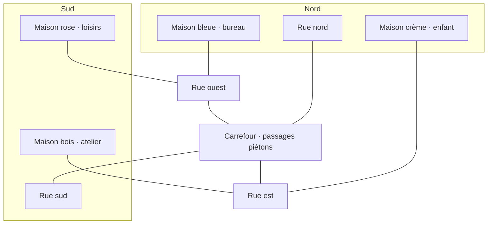

# Maple Crossing — plan de construction

## Version agrandie après essai en jeu

- Surface portée à **176 × 176 blocs**, hauteur 32 : environ 2,47 fois la surface initiale.
- **Neuf maisons meublées**, parcelles de 42 × 42 espacées de 62 blocs, aux origines
  x/z 4, 66 et 128. Les deux premières rangées ouvrent au sud, la dernière au nord.
- Deux rues nord-sud et deux rues est-ouest (51–60 et 113–122), quatre croisements,
  trottoirs continus, passages piétons, marquages, égouts et éclairage.
- **400 décors**, dix-huit grands arbres et quatre voitures garées dans les rues.
  Les plans intérieurs et les orientations des meubles sont conservés.
- **Huit soldats au lieu de douze**, départ joueur conservé dans le jardin nord-ouest.
  Apparitions ennemies à au moins 85 blocs du joueur et 24 blocs entre soldats,
  réparties entre les parcelles éloignées accessibles par le sol.
- Limite du format de carte portée à 512 décors ; version du fichier inchangée.
- Vérifications : compilation Kotlin, génération et accès aux pièces, sauvegarde/relecture,
  puis 100 répartitions aléatoires de huit soldats sur une grille conservatrice incluant
  les collisions du mobilier. Rendu et performances sur appareil à vérifier en jeu.

## Plan initial (version de quatre maisons)

## Intention

Carte Assaut solo : quatre petites maisons américaines habitables autour d’un croisement.
Structures en blocs Cave World, mobilier et accessoires issus des modèles Toybox.
Les bâtiments sont des maisons de plain-pied avec porches couverts et garages attenants,
pas des modèles de maisons fermées posés sur le terrain. Visite et combat à l’intérieur.

## Implantation arrêtée avant construction

- Carte : 112 × 112 blocs, hauteur 32. Quatre parcelles de 42 × 42.
- Nord-ouest : parcelle (4,4), maison bleue, bureau de télétravail.
- Nord-est : parcelle (66,4), maison crème, chambre d’enfant et jouets.
- Sud-ouest : parcelle (4,66), maison rose, pièce de loisirs.
- Sud-est : parcelle (66,66), maison en bois, atelier / salle de sport.
- Maisons nord orientées vers le sud ; maisons sud tournées de 180°, vers le nord.
- Chaussées en croix : x 51–60 et z 51–60. Double ligne jaune, lignes d’arrêt,
  passages piétons, plaques d’égout et grilles près des bordures.
- Trottoirs x/z 47–50 et 61–64, raccordés aux porches et aux allées de garage.
- Sol de la chaussée à y=3 ; terrain, trottoir et plancher à y=4. Un bloc de dénivelé,
  franchissable par la physique et la navigation existantes ; bordures basses intermédiaires.
- Limite de carte fermée, routes terminées par des barrières ; pas de chute dans le vide.

## Plan intérieur commun (coordonnées locales à chaque parcelle)

Maison : x 4–29, z 10–33 ; sol y=4, murs y=5–8, plafond y=9, toiture au-dessus.
Les pièces utilisent une orientation locale unique ; la rotation du bâtiment transforme
ensemble les blocs, fenêtres, portes, meubles, volumes de collision et accès.

| Espace | Surface intérieure | Accès et organisation |
|---|---|---|
| Couloir | x 16–18, z 11–32 | Axe de trois blocs, entrées avant/arrière ; aucun meuble |
| Chambre | x 5–14, z 11–20 | Lit tête au mur arrière, chevets latéraux, armoire hors passage |
| Salon | x 5–14, z 22–32 | Canapé face à la télévision, table basse entre les deux |
| Salle de bain | x 20–28, z 11–17 | Douche/baignoire, lavabo et miroir alignés, WC dégagés |
| Pièce secondaire | x 20–28, z 19–23 | Bureau, enfant, jeux ou loisirs selon la maison |
| Cuisine / repas | x 20–28, z 25–32 | Équipements contre le mur, table et chaises vers le centre |
| Garage | x 31–39, z 19–33 | Voiture dans l’axe de sortie, établi au fond, accès latéral |
| Porche | x 12–22, z 34–36 | Auvent, piliers hors entrée ; allée vers le trottoir |

Portes sans battant : deux à trois blocs de large, trois blocs de hauteur libre.
Fenêtres vitrées à hauteur de regard, encadrements blancs. Toits à deux pans,
cheminées, garage plus bas que la maison. Deux passages latéraux vers les jardins arrière.

## Règles de mobilier

1. Employer les modèles partagés sans copier leur géométrie.
2. Définir la façade de chaque meuble (+Z du modèle) avant de choisir sa rotation.
3. Préserver les ouvertures et les couloirs ; vérifier les volumes réels des pièces solides
   contre les murs et les passages réservés, pas seulement le point central du meuble.
4. Poser les accessoires à la hauteur exacte du support : PC sur bureau, grille-pain
   sur plan de travail, lampe sur chevet, petits jouets sur commode ou au sol hors passage.
5. Utiliser des ensembles cohérents : chaise face au bureau, écran face au canapé,
   sanitaires orientés vers l’espace libre, voitures alignées avec leur allée.
6. Répartir les familles de décors selon l’usage des pièces. Les accessoires de Toybox
   servent à donner une identité aux maisons ; aucun besoin de remplir chaque surface.
7. Rester sous la limite actuelle de 256 objets par carte et regrouper le rendu statique.

## Extérieurs

Grands arbres natifs, troncs et branches en blocs, placés dans les jardins et près des
angles des parcelles avec une marge suffisante pour les toitures. Haies et bancs,
boîtes aux lettres à l’entrée, jardinières sur les porches. Clôtures basses dans les zones
où elles ne condamnent pas les chemins de contournement. Voitures et bacs fournissent
des couverts, mais ne ferment ni les trottoirs ni les sorties.

## Nouveaux matériaux

Textures procédurales originales pour : asphalte, béton, dalles de trottoir, bordure,
plaque d’égout circulaire, grille de drainage, marquages blancs et jaunes, bardeaux de toit,
carrelage de salle de bain et plafonnier. Noms disponibles en français et anglais.
Les matériaux sont des blocs enregistrés, réutilisables dans Cave World.

## Combat et validation

- Départ du joueur dans le secteur nord-ouest, protégé par la maison.
- Ennemis répartis entre maisons, garages et jardins éloignés ; jamais sur le toit,
  un arbre ou une armoire. Déploiement limité aux nœuds reliés au départ du joueur.
- Trois types de trajets : rue, intérieur traversant, jardins et côtés des maisons.
- Vérifications de construction : limites, décor/murs, accès réservés, hauteur des supports,
  portes, existence des modèles, budget d’objets et connectivité du plan au sol.
- Seule commande Gradle autorisée : `compileDebugKotlin`. Aucun APK construit ou installé.
  Le rendu et le comportement des bots sur appareil restent à tester par l’utilisateur.

## Ordre de réalisation

1. Enregistrer les matériaux et leurs textures.
2. Construire rues et parcelles, puis une maison avec son plan complet et ses meubles.
3. Instancier les quatre maisons par transformation, ajouter leurs variantes et jardins.
4. Intégrer la carte à la liste Assaut et son déploiement d’ennemis.
5. Vérifier les invariants de construction et compiler ; documenter le résultat.

## Réalisation

- Carte intégrée au sélecteur Assaut sous « Maple Crossing — lotissement américain ».
- Quinze matériaux enregistrés, de l’asphalte au plafonnier, avec libellés FR/EN.
- Quatre maisons et garages traversants, huit grands arbres, deux voitures dans la rue.
- Les accessoires utilisent la surface de pose effective : plateau de l’établi à 10 unités,
  table à manger à 11,1 unités, indépendamment du panneau mural et de la vaisselle.
- Douze adversaires répartis sur les trois parcelles opposées ; manche de dix minutes.
- La création de carte contrôle les intersections décor/blocs et les passages réservés,
  puis recherche un chemin au sol jusqu’à chaque pièce et garage. Le déploiement des bots
  filtre aussi les nœuds accessibles au niveau de la rue et des planchers.
- Validation sur appareil laissée à l’utilisateur ; aucun APK généré ou installé.
