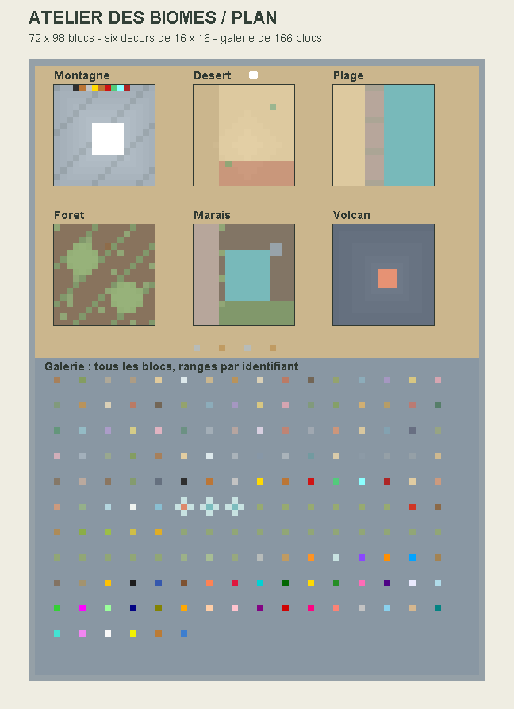
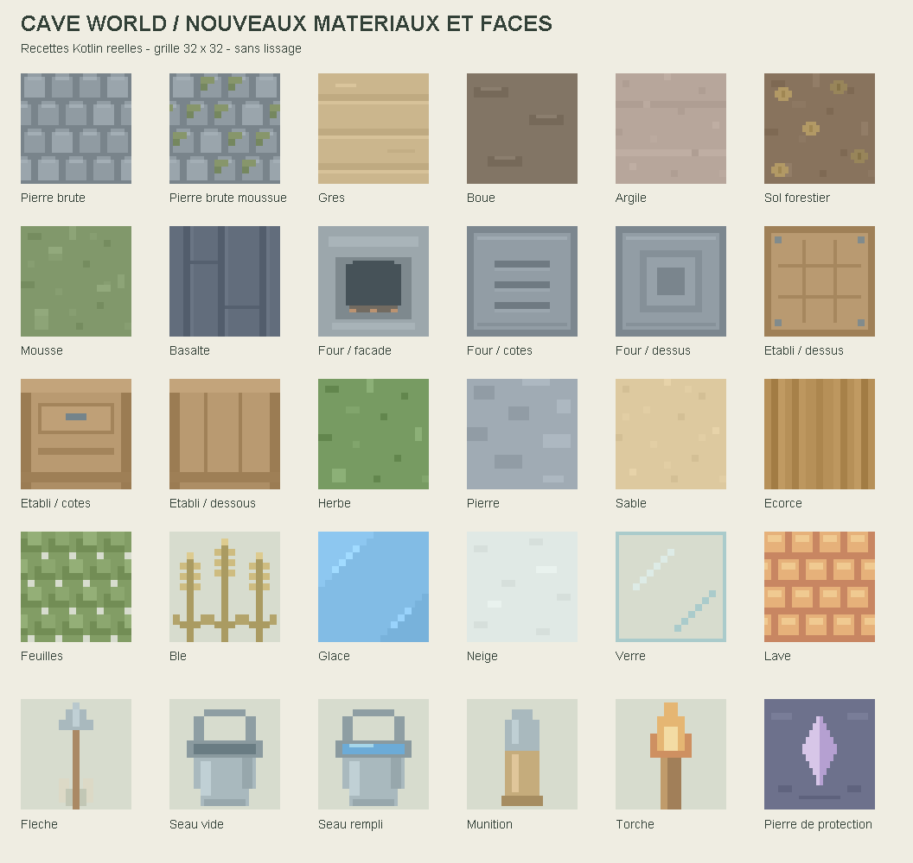

# Atelier des biomes

Accès : Cave World → Assaut → **Atelier des biomes · visite libre**.
Carte intégrée, disponible sans export ni téléchargement. La visite est sans
combat, manches ou chronomètre, à midi fixe. Les blocs ne sont pas modifiables.
Une chute dans le vide ramène au départ. La carte de combat existante est conservée.

Le monde mesure désormais 72 × 156 blocs au sol et 32 blocs de haut. Il comporte six
vignettes de 16 × 16 cases (256 cases de surface chacune), reliées par des allées :

- Montagne en gradins, sommet enneigé, glace, éboulis et coupe de minerais.
- Désert, petite dune, grès, sable rouge et cactus.
- Plage, graviers, argile et bassin côtier.
- Forêt, arbres ordinaires et bouleau, sol forestier, mousse et champignons.
- Marais, boue, argile, roseaux et pierre moussue.
- Relief volcanique en basalte avec bassin de lave contenu.

Deux fours et deux établis sont présentés au bord du chemin, avec orientations
différentes. Le four possède désormais des côtés à évents et un dessus dédié ;
l'établi possède des côtés avec tiroir et tablette, et un dessous en bois encadré.

La galerie expose automatiquement chaque entrée du registre, triée par identifiant :
166 blocs actuellement, directement posés au sol sans socle, y compris les marqueurs et liquides. Les liquides sont
placés dans des récipients en verre. Le bandeau affiche la zone, puis le nom de
l'échantillon proche dans la galerie. Ce nom dépend de la position, pas de la visée.
La longueur de la carte augmente automatiquement si le registre s'agrandit.

Après les blocs, 39 mannequins présentent les 12 créatures enregistrées et le
soldat d’Assaut. Chaque groupe dispose de trois exemplaires au sol : référence
(bras en T pour les humanoïdes, pose neutre pour les autres), repos, puis action.
Le slime oscille et le spectre flotte au repos ; les autres n’ont pas d’idle animé.
Les humanoïdes montrent leur attaque existante et l’araignée marche sur place.
Le slime et le spectre conservent leur mouvement naturel dans la colonne action.
Le bandeau nomme le mannequin le plus proche et précise l’animation disponible.

Le soldat montre trois tirs suivis d’une pause, avec recul des bras et du fusil
et flash du canon. Ce recul est aussi déclenché par les tirs réels en Assaut.
Il n’existe pas encore d’animation de rechargement. Les mannequins sont séparés
des cibles de combat : aucune IA, aucun dégât, aucun projectile ni butin.
Les corps proches sont rendus par lots de 32 maximum, sans barre de vie.
Les arbres utilisent les teintes prévues pour ces décors ; la galerie est neutre.

Deux bandes d'herbe longent l'allée des fours et établis, de part et d'autre :
prairie → marais à gauche, sec → jungle à droite. Elles permettent d'observer
la transition continue sur deux blocs, notamment avec les touffes au bord.
Le style Pastel/Vif est choisi dans le menu avant d'entrer sur la carte.

## Matériaux ajoutés

| Identifiant | Bloc |
|---|---|
| 2300 | Pierre brute / cobblestone |
| 2301 | Pierre brute moussue |
| 2302 | Grès |
| 2303 | Boue |
| 2304 | Argile |
| 2305 | Sol forestier |
| 2306 | Mousse |
| 2307 | Basalte |

Ils sont disponibles dans le registre et l'inventaire créatif, avec noms anglais
et français. Ils ne sont ajoutés à aucune distribution de biomes de survie.
Le comportement de collecte de la pierre existante ne change pas.

## Vérifications

- `compileDebugKotlin` réussi ; aucun APK construit ou installé.
- Les 166 identifiants du registre sont présents dans la carte générée.
- Aucun identifiant de bloc inconnu ; spawn dégagé avec sol, pieds et tête libres.
- Tous les liquides ont un support et des côtés fermés.
- Aller-retour sérialisation A2Map vérifié, blocs et orientations conservés.
- Plan produit depuis le générateur Kotlin compilé, avec les identifiants et
  couleurs des JSON réels. Ce plan ne représente pas l'éclairage 3D du jeu.
- 172 recettes de textures utilisées, 181 couches GPU de 32 × 32, variantes d'écorce comprises.
  Le climat utilise désormais un champ de couleur interpolé plutôt que des couches supplémentaires.

Le parcours, les collisions et le rendu final restent à vérifier sur appareil.
Les scènes sont définies dans `ShowcaseMap.kt`, les règles de visite dans
`ShowcaseMode.kt`. Les aperçus proviennent de ces données et des recettes Kotlin,
sans créer un second générateur de carte.
