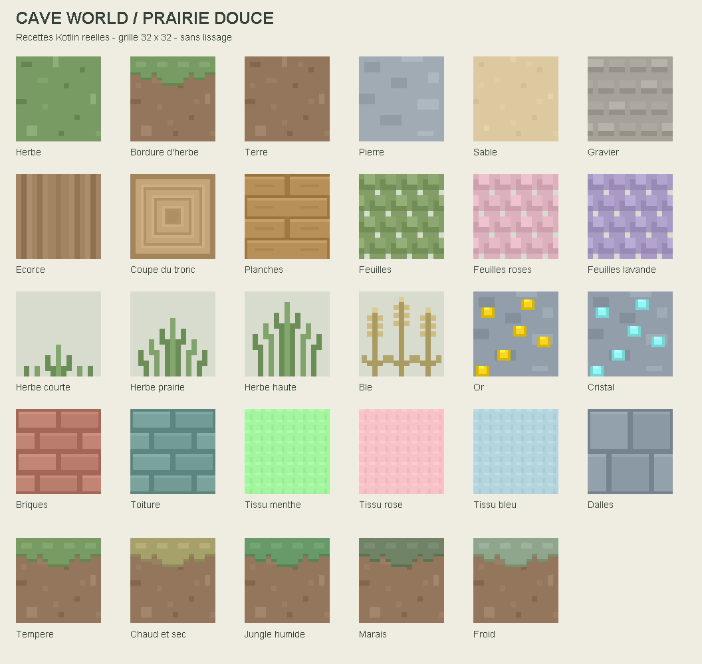
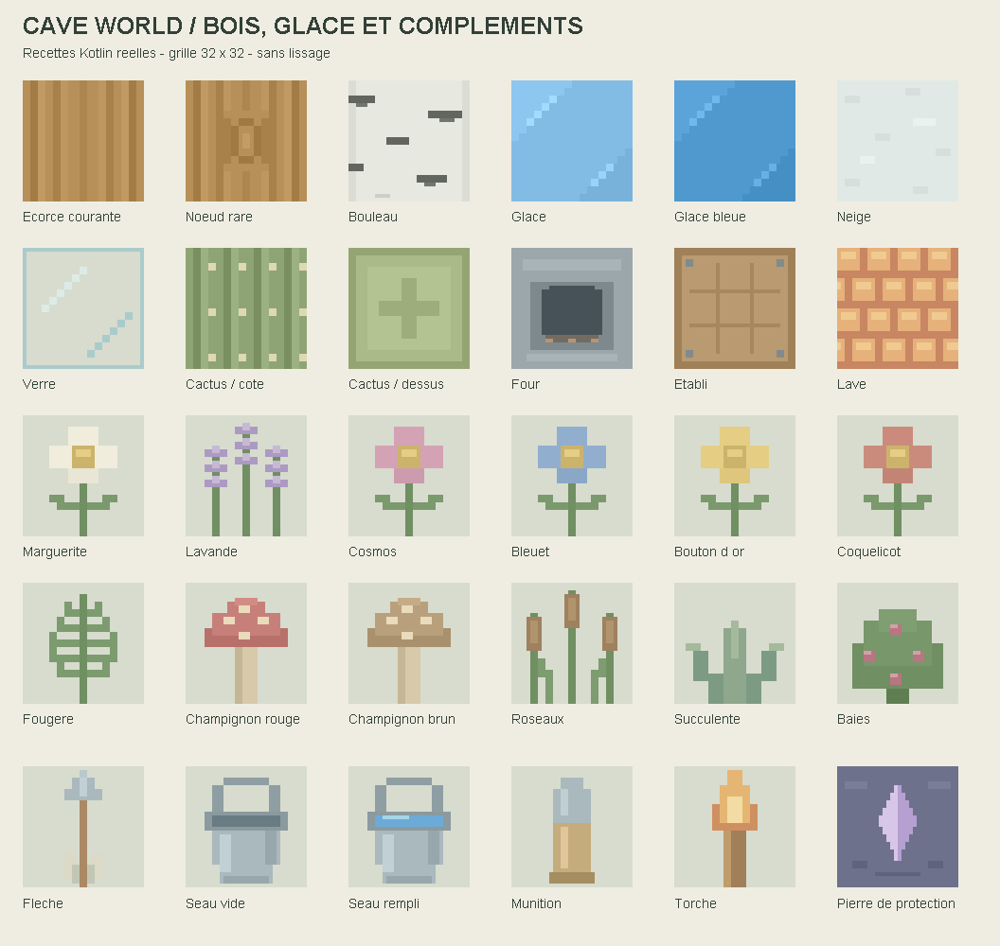
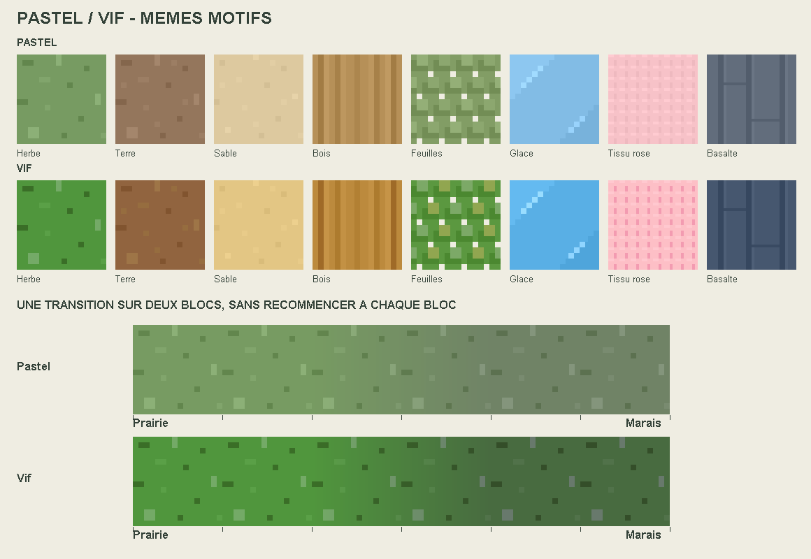

# Cave World — Prairie douce

Banque originale de textures procédurales, inspirée des aplats et petits motifs
rectangulaires de la référence visuelle. Tous les dessins du terrain utilisent
une grille de 32 × 32 pixels, une palette courte et aucun lissage.

## Fonctionnement

`MeadowTextures.kt` produit directement les pixels en mémoire. Le registre charge
ces images dans la texture array OpenGL, puis libère les bitmaps de chargement.
Les copies destinées à l'inventaire sont conservées comme auparavant. Aucun PNG
de cette nouvelle banque n'est nécessaire au jeu : la planche ci-dessus sert
uniquement à la documentation.

Les identifiants `cozy:` existants restent valides. Les blocs et les sauvegardes
ne changent pas. Les anciennes images sont conservées sur disque.

Familles remplacées : terre, herbe et bordures, pierre, sable, gravier, bois,
planches, feuillage, minerais, tissus, briques, toiture, dalles, couvre-sol,
fleurs, champignons, fougères, roseaux, baies, cactus, neige, glace et glace bleue,
verre, four, établi, lave et icônes d'eau. Cela représente les 156 références
`cozy:` existantes, désormais toutes procédurales. L'ancien découpage des atlas
PNG a été retiré du registre. Les images sources restent sur disque.
Les six dernières références (flèche, deux seaux, munition, torche et pierre de
protection) sont désormais générées par la même banque : 162 recettes de base
au total. Les anciens noms de fichiers restent des identifiants compatibles,
mais le registre utilise leurs générateurs. Les sprites d'équipement utilisés
ailleurs dans le jeu ne sont pas modifiés par ce remplacement des textures du registre.

L'eau du monde conserve son rendu animé dédié : les recettes d'eau concernent
ses icônes de blocs. La glace est givrée, avec des reflets pixelisés, sans nouvelle
transparence graduelle. Sa palette est franchement bleue, avec une variante
plus profonde pour la glace bleue ; les courts reflets remplacent les anciennes
bandes qui évoquaient des veines de marbre. Le verre utilise des pixels transparents entre ses bords
et ses reflets, compatibles avec le shader existant.

L'écorce courante est droite, sans nœud. Neuf variantes teintées avec un nœud
sont partagées entre les blocs. Un hachage des coordonnées mondiales choisit une
face candidate sur environ un bloc sur douze ; les faces de coupe ne sont jamais
remplacées, ce qui réduit encore la fréquence effective. Un bloc ne porte donc
jamais de nœud sur plusieurs côtés, même lorsqu'il est posé horizontalement.
Le bouleau a son propre fond blanc cassé et ses traits anthracite, sans nœud.
Ses marques sont décalées, de longueurs différentes, sans miroir gauche-droite.
L'inventaire montre l'écorce ordinaire.

## Palette et climat

Le bouton **Palette : Pastel / Vif** du menu Cave World change de style en un
clic. Le choix est mémorisé sur l'appareil et lu à la prochaine ouverture d'un
monde (survie ou carte Assaut). Il ne change ni les sauvegardes ni les identifiants.
`CavePalette` définit des couleurs de référence vives par matériau et conserve
les nuances voisines ; les autres couleurs reçoivent un ajustement modéré.
Les textures, icônes du registre, couleurs du rendu lointain et de la minimap
suivent ce choix. Le ciel de jour et l'eau ont aussi leur variante vive.

La palette de base et les recettes sont indépendantes. Les motifs sont composés
à coordonnées fixes, sans placement aléatoire : une autre couleur ne déplace pas
les détails, et recharger le jeu
ne change pas leur disposition. Une recette est partagée par les blocs qui
l'utilisent ; il n'y a pas de nouveau tirage à chaque bloc ni à chaque image.

Les détails du sol suivent principalement une grille de 16 × 16 agrandie par
pas de deux pixels : carrés isolés et formes espacées, sans bruit superposé.
Les cernes du tronc sont centrés sur (15,5 ; 15,5), avec symétrie horizontale
et verticale. L'écorce ordinaire, les touffes et les trois épis de blé sont composés par
paires symétriques ; les grains sont répartis de chaque côté des tiges.

Les biomes de surface peuvent définir `temperature` et `humidity` entre 0 et 1
(0,55 par défaut). Ce sont des paramètres visuels, pas une simulation météo.
`World.vegetationClimateAt` utilise les poids du système de biomes existant pour
choisir parmi cinq palettes : tempérée, sèche, jungle, marais et froide.
Ces cinq palettes définissent les couleurs intérieures des zones. À la frontière,
`ClimateBlend` construit un champ de couleur continu, commun aux blocs voisins.
Chaque coin mélange les quatre colonnes adjacentes ; les faces interpolent entre
ces coins. Sur une frontière droite, le mélange entier occupe **deux blocs** :
couleur pure à une extrémité, 50/50 à la frontière, couleur pure à l'autre extrémité.
Il ne recommence pas à chaque texture. Les coordonnées mondiales garantissent
les mêmes coins des deux côtés d'une frontière de chunks, même négative.
Les intersections de plusieurs zones mélangent leurs couleurs de la même façon.

Seules l'herbe, les bordures herbeuses, les touffes vertes et les feuilles
naturelles concernées sont recolorées. La terre sous la bordure et les trous
transparents sont préservés. Les arbres roses, bleus, jaunes et violets conservent
leur identité. Le sous-sol à altitude négative et les icônes d'inventaire gardent
la palette de base.

Après ajout des huit matériaux naturels et des faces du four et de l'établi,
la banque utilise 172 recettes de base. Voir [l'atelier des biomes](ATELIER_BIOMES.md).
Le résultat utilise 181 couches de 32 × 32 RGBA, soit environ 724 Kio de pixels
GPU hors structures de gestion et copies UI : les anciennes images par climat
ont été retirées. Le maillage du terrain passe de 7 à 11 flottants par sommet
pour transporter le mélange RGB et son masque. Les calculs climatiques sont
mis en cache localement pendant sa construction, jamais recalculés par pixel
à chaque image. Le shader applique seulement la couleur interpolée aux parties
végétales, avec le même masque pixelisé que la bordure d'herbe d'origine.

## Vérification

- `compileDebugKotlin` : réussi après intégration des biomes.
- Planche inspectée visuellement, produite à partir de `MeadowTextures.pixels`
  compilé (petits adaptateurs JVM pour les opérations de couleur Android).
- Les 162 recettes utilisées ont été parcourues ; transparence des variantes et
  absence de recoloration de la terre sous l'herbe vérifiées.
- Symétrie des troncs et des quatre stades de blé vérifiée pixel par pixel.
- Asymétrie des marques du bouleau vérifiée séparément.
- Pastel/Vif : transparences des 172 recettes préservées ; couleur médiane,
  largeur de deux blocs et raccords entre chunks positifs/négatifs vérifiés
  depuis le code compilé. Le comparatif illustre ce champ de couleur, sans
  simuler l'éclairage du jeu. Le shader OpenGL reste à valider sur appareil.
- Rareté et stabilité des nœuds vérifiées sur 81 920 positions : 6 723 faces
  candidates, avant exclusion des coupes de tronc et du bouleau.
- Aucun APK construit ou installé. L'éclairage, les ombres et la lisibilité en
  mouvement restent à apprécier sur appareil ; la planche montre les couleurs
  des textures sans l'éclairage du jeu.

Pour ajuster le style, modifier `materials` et `climateColors` dans
`MeadowTextures.kt`, ou la densité et le contraste de chaque recette. Pour
ajuster un biome, modifier ses deux paramètres dans son JSON de surface.
