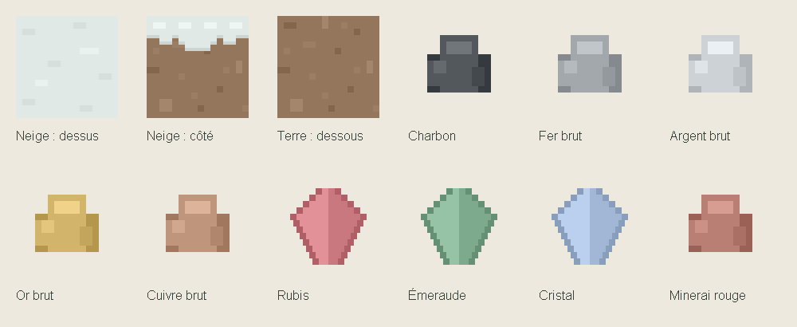

# Casse et récolte

La survie utilise désormais le champ `drop` des JSON dans `assets/caves/blocks`.
Il était auparavant ignoré par le minage : presque tout donnait le bloc intact.
Le mode créatif continue de détruire sans récolter. L’atelier reste non modifiable.

| Catégorie | Règle actuelle |
| --- | --- |
| `covered_soil` | Herbe, terre enneigée/sablée, sol forestier et chemin → terre. Terre graveleuse → gravier. |
| `fractured_stone` | Pierre ordinaire et ses couvertures → cobble. Cobble moussue → cobble ; caillou moussu → caillou. Roche grise sablée → roche grise ; variante sable rouge → sable rouge. |
| `ore` | Les neuf minerais → une ressource brute chacun, IDs 3100–3108. |
| `fragile` | Verre, glaces, feuillages, herbes et fougères → aucun objet. |
| `liquid` | Eau et lave → aucun objet au minage. Le seau garde son fonctionnement propre. |
| `unharvestable_crop` | Le blé décoratif n’a pas encore de récolte agricole ; aucun objet, conformément à ses JSON. |
| `technical` | Marqueurs de départ → aucun objet. |
| `resource` | Objets bruts de fabrication, non posables. |
| `recoverable` (défaut) | Bois, planches, constructions, équipements, sable, neige et autres matériaux conservés selon leur champ `drop`. Les fleurs et champignons restent récupérables. |

Les roches distinctes comme le granite, le basalte, le grès et le calcaire restent
des matériaux récupérables : elles ne sont pas toutes réduites à une cobble identique.
La règle est déterministe, sans outils obligatoires ni enchantement ajouté.

## Champs éditables

- `drop` : nom d’une définition existante ; chaîne vide = aucun objet.
- `drop_count` : quantité entière positive, 1 par défaut.
- `harvest_category` : famille documentée ci-dessus ; décrit la règle, sans remplacer `drop`.
- `placeable` : `false` pour une ressource d’inventaire, `true` par défaut.

Le registre résout et valide les références au chargement. La récolte n’applique
qu’une transformation : elle ne recasse pas automatiquement le résultat.
Le panneau d’inventaire montre le résultat et distingue les ressources non posables.

## Fabrication et sauvegardes

Les recettes d’origine restent présentes pour les stocks des anciennes sauvegardes.
Des variantes `_harvest.json` acceptent la cobble et les ressources brutes. Une
recette cobble → pierre permet aussi de retrouver le bloc lisse pour construire.
Les IDs existants et les sauvegardes ne sont pas convertis. Les nouvelles ressources
ont des icônes procédurales 32 × 32 et une catégorie « Ressources brutes ».

La terre enneigée a un dessus neigeux, une frange latérale de neige et un dessous
de terre. La terre sablée reçoit également son rebord et son dessous de terre.

Validation : compilation Kotlin, références de récolte et de recettes, IDs uniques,
icônes transparentes et conservation de la terre sous le rebord neigeux.
Le rendu et la récolte en partie restent à vérifier sur appareil.

## Visée des décorations

Les cailloux, plantes et fleurs se sélectionnent sur leurs pixels visibles. Le
rayon teste les deux plans croisés réellement dessinés, avec leur marge et leur
hauteur, puis le masque alpha de la texture. Un trou transparent laisse atteindre
l’autre plan ou le bloc derrière. Le seuil alpha est celui du shader (128/255).
Les masques sont construits avec l’atlas et partagés entre textures identiques ;
aucune lecture GPU ni génération de texture pendant la visée. Le déplacement du
joueur conserve son comportement habituel.

Validation : compilation Kotlin et 13 vérifications de rayons (deux plans, pixels
transparents, bordures, hauteur, portée, départ dans une case et seuil alpha).
